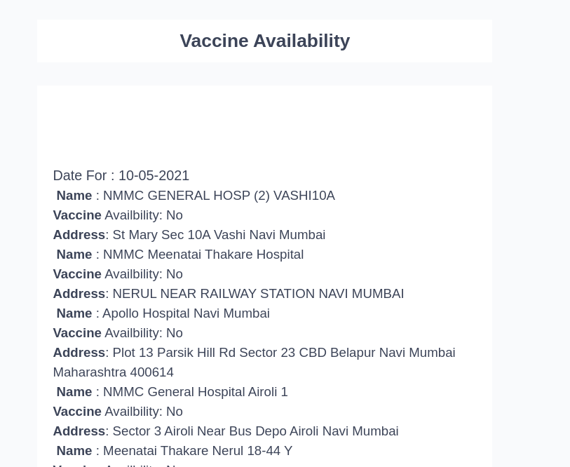

### Automatic Sending Vaccine Details ##
- I have used amplify to create lambda function
- Install amplify cli
- run ``` amplify init ```
- Follow the instruction
- use ``` amplify push ``` to deploy your code
### Email service provided ###
- I have used [https://www.sendinblue.com/] (https://www.sendinblue.com/)
- Create your free account
- And add your api key
- Goto Send in blue dashboard
- Create new template
- Copy below snippet and paste it inside that template
```html 
 

 
Date For : {{ hospital.date }}

 Name : {{ hos.name }}
Vaccine Availbility: {{ hos.is_vaccine_available }}
Address: {{ hos.address }}




```
### Find State ID and district ID

- You will be needing state ID and District ID
- First find state ID at this link [https://cdn-api.co-vin.in/api/v2/admin/location/states]( https://cdn-api.co-vin.in/api/v2/admin/location/states ) - (Pro tip install json formatter plugin on chrome)
- Once you have ID find your district, here in my case state id of MH is 21. So i passed 21 next at the end of this link [https://cdn-api.co-vin.in/api/v2/admin/location/districts/21] (https://cdn-api.co-vin.in/api/v2/admin/location/districts/21)
- Once you have district id replace this inside the code(I have commented the code)

### Making this function run at specific interval
- Goto cloud watch in AWS console
- Create a Rule
- I am running this function thrice a day from 9am to 8pm
- You can use below cron tag
- ``` 0 6-2/4 ? * MON-SUN * ```

## Below is the sample email 

